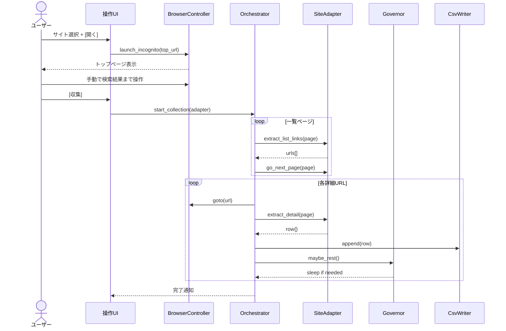

# 半手動リスト収集ツール — 仕様書（v0.1）

> **用途**: 別フォルダに移して新規プロジェクトとして実装するための設計ドキュメント  
> **作成日**: 2026-08-18  
> **ステータス**: ドラフト（実装前）

---

## 1. プロジェクト概要

### 1.1 目的

ユーザーがブラウザ上で検索条件を指定し、**検索結果一覧から企業・店舗情報を半自動で収集して CSV に保存する**デスクトップツールを開発する。

操作の多くはユーザーが行い、ツールは「結果ページ以降のリンク巡回・項目抽出・保存・負荷制御」を担当する **半手動アシスト型** とする。

### 1.2 参考にした操作イメージ

既存の商用ツール（ListReach 等）と同様の UX を目指すが、**本プロジェクトはゼロから独立実装**とし、第三者製品の解析・模倣・コード流用は行わない。

### 1.3 合法利用の前提（必須）

本ツールは次の条件を満たす対象サイトのみを想定する。

| 条件 | 説明 |
|------|------|
| 利用許可 | 自社サイト、または書面・契約でスクレイピング許可があるサイト |
| 規約確認 | 対象サイトの robots.txt・利用規約を確認し、アダプタ追加前にチェックリストを完了すること |
| API 優先 | 公式 API が存在する場合は API 経由を優先し、HTML 解析は補助とする |
| 学習・開発 | 初期実装は **ローカルテスト HTML** で動作確認してから本番サイトに接続する |

> **禁止**: 利用規約で自動取得が禁じられている第三者サイト（求人サイト、地図サービス、店舗ポータル等）を、許可なくアダプタ追加して使うこと。

---

## 2. ユーザー操作フロー

```text
┌─────────────────────────────────────────────────────────────┐
│ 1. 操作 UI で対象サイトをドロップダウンから選択              │
│ 2. [開く] を押す                                            │
│    → シークレットウィンドウでそのサイトのトップページを表示   │
│ 3. ユーザーが手動で検索し、「検索結果一覧」画面まで操作      │
│ 4. 操作 UI の [収集] を押す                                 │
│    → 現在表示中の結果ページからリンクを辿り情報を取得         │
│ 5. 完了後、output/ に CSV が保存される                      │
└─────────────────────────────────────────────────────────────┘
```

### 2.1 詳細ステップ

| Step | 主体 | 動作 |
|------|------|------|
| 1 | ユーザー | 収集サイトを選択、必要なら取得件数・ペースを設定 |
| 2 | ユーザー | [開く] — ブラウザ起動 |
| 3 | ツール | シークレット（Incognito）モードで選択サイトのトップ URL を開く |
| 4 | ユーザー | キーワード・エリア等を入力し、**一覧が並んだ結果ページ**まで操作 |
| 5 | ユーザー | [収集] — 収集開始 |
| 6 | ツール | 結果ページのリンクを列挙 → 各詳細を開く → 項目抽出 → CSV 追記 |
| 7 | ツール | 件数上限に達するか、一覧が尽きるまで繰り返し（ページ送り含む） |
| 8 | ユーザー | 必要に応じて [停止] で中断 |

### 2.2 収集中のユーザー操作

- 収集中は **ブラウザを触らない** こと（操作 UI からの停止は可）
- Chrome を誤って閉じた場合は [開く] で再接続できること

---

## 3. 機能要件

### 3.1 操作 UI

| 要素 | 種別 | 説明 |
|------|------|------|
| 収集サイト | ドロップダウン（ComboBox） | 登録済みサイトアダプタから選択 |
| 取得件数 | 数値入力 | 上限件数。`0` = 上限なし（またはサイト側上限まで） |
| 収集ペース | 選択（任意） | 安全 / 標準 / 速め — 待機時間の倍率に反映 |
| [開く] | ボタン | ブラウザ起動・トップページ表示 |
| [収集] | ボタン | 現在タブの結果ページから収集開始 |
| [停止] | ボタン | 安全な区切りで収集中断 |
| 進捗ログ | テキストエリア | 件数・現在処理中の名称・休憩通知など |
| 残り件数 | ラベル（任意） | 今回設定した上限に対する進捗 |

### 3.2 ブラウザ連携

| 項目 | 仕様 |
|------|------|
| ブラウザ | Google Chrome（Playwright 経由推奨） |
| モード | **シークレット（Incognito）** — ログイン状態や Cookie の影響を避ける |
| 接続方式 | CDP / Playwright の persistent context または launch + connect |
| プロファイル | プロジェクト配下 `output/.browser_profile/` に隔離（本体と分離） |
| 対象 URL | 各サイトアダプタが `top_url` を保持 |

### 3.3 収集処理

#### フェーズ A: 一覧からリンク収集

- 現在アクティブなタブの URL を起点とする
- サイトアダプタが定義する CSS セレクタ / XPath で一覧リンクを抽出
- ページネーション（次へボタン、ページ番号等）があればアダプタが処理
- 重複 URL は除外

#### フェーズ B: 詳細ページから項目抽出

各リンクを順に開き、以下の **基本項目** を取得する。

| 列名 | 必須 | 説明 |
|------|------|------|
| 会社名 | ○ | 法人名・店舗名 |
| 住所 | ○ | 所在地 |
| 電話番号 | ○ | 代表電話等 |
| 詳細URL | ○ | 取得元ページ URL |
| 取得日時 | 任意 | ISO8601 または `YYYY/MM/DD HH:MM` |

サイトによって追加列（HP、業種、メール等）をアダプタ側で拡張可能とする。

#### フェーズ C: CSV 出力

- 保存先: `output/{site_id}_full_{YYYYMMDD_HHMMSS}.csv`
- 文字コード: **UTF-8 with BOM**（Excel 文字化け対策）
- 1 行 = 1 件
- 収集途中のクラッシュに備え、**N 件ごとに flush** する

### 3.4 負荷制御（Governor）

相手サーバーへの負担を抑えるため、以下を **必須** とする。

```text
詳細ページを 1〜K 件処理（K はランダム）
    ↓
ランダム待機: 数十秒〜数百秒（例: 30〜300 秒、ペース設定で倍率変更）
    ↓
再開（ログに [休憩] / [再開] を表示）
```

| パラメータ | 標準値（例） | 説明 |
|------------|--------------|------|
| `batch_min` | 1 | 1 バッチあたりの最小処理件数 |
| `batch_max` | 5 | 1 バッチあたりの最大処理件数 |
| `rest_min_sec` | 30 | 最小休憩秒数 |
| `rest_max_sec` | 300 | 最大休憩秒数 |
| ページ間待機 | 1〜3 秒 | 一覧・詳細遷移時の短い wait |

- 待機時間は `random.uniform()` 等で毎回変える
- 「安全」ペース: 倍率 1.5、「速め」: 倍率 0.7 など

### 3.5 サイトアダプタ（拡張設計）

対象サイトは増えていく前提。**1 サイト = 1 アダプタモジュール** とする。

```text
adapters/
  __init__.py
  base.py          # 抽象基底クラス
  mock_demo.py     # 学習用テストサイト（最初に実装）
  site_foo.py      # 将来追加
  site_bar.py      # 将来追加
```

#### 基底クラス `SiteAdapter` のインターフェース（案）

```python
class SiteAdapter(ABC):
    site_id: str           # "mock_demo"
    display_name: str      # UI ドロップダウン表示名
    top_url: str           # トップページ URL

    def validate_list_page(self, page) -> bool:
        """現在ページが収集可能な一覧か判定"""

    def extract_list_links(self, page) -> list[str]:
        """一覧ページから詳細 URL を列挙"""

    def go_next_page(self, page) -> bool:
        """次ページへ。なければ False"""

    def extract_detail(self, page, url: str) -> dict:
        """詳細ページから {会社名, 住所, 電話番号, ...} を返す"""
```

- 新サイト追加 = 新ファイル + レジストリ登録のみ
- アダプタ追加時は `docs/adapters/{site_id}.md` に規約確認メモを残す

---

## 4. 非機能要件

| 項目 | 要件 |
|------|------|
| OS | Windows 10/11（初期ターゲット） |
| 言語 | Python 3.11+ |
| GUI | CustomTkinter または Tkinter |
| ブラウザ自動化 | Playwright（`playwright install chromium` または Chrome チャネル） |
| 配布 | 将来 PyInstaller 等で exe 化可能な構成 |
| ログ | `logs/app.log` にファイル出力 + UI 表示 |
| 設定 | `config.json` — 待機時間のデフォルト、output パス等 |

---

## 5. ディレクトリ構成（新規プロジェクト案）

```text
list-collector/                 # 別フォルダに移して新規作成
├── main.py                     # エントリポイント
├── config.json
├── requirements.txt
├── README.md
├── SPEC.md                     # 本ファイルをコピー
├── ui/
│   └── app_window.py           # メイン GUI
├── browser/
│   └── controller.py           # Playwright 起動・シークレット・タブ操作
├── collector/
│   ├── orchestrator.py         # 収集フロー全体
│   ├── governor.py             # 待機・バッチ制御
│   └── csv_writer.py
├── adapters/
│   ├── base.py
│   ├── registry.py             # ドロップダウン用一覧
│   └── mock_demo.py            # 最初の動作確認用
├── test_fixtures/
│   └── mock_site/              # ローカル HTML（file:// または localhost）
│       ├── index.html
│       ├── list.html
│       └── detail_001.html
├── output/                     # CSV 出力（gitignore）
└── logs/                       # ログ（gitignore）
```

---

## 6. 画面ワイヤーフレーム（テキスト）

```text
┌─ 半手動リスト収集ツール ─────────────────────────────┐
│  収集サイト: [ mock_demo（テスト）    ▼ ]            │
│  取得件数:   [ 100  ]  （0 = 上限なし）              │
│  ペース:     ( )安全  (●)標準  ( )速め               │
│                                                      │
│  [ 開く ]  [ 収集開始 ]  [ 停止 ]                    │
│                                                      │
│  進捗: 45 / 100                                      │
│  ┌─ ログ ─────────────────────────────────────┐   │
│  │ [11:20:01] Chrome を起動しました              │   │
│  │ [11:21:15] 一覧から 45 件の URL を取得        │   │
│  │ [11:21:18] [1/45] 株式会社サンプル            │   │
│  │ [11:21:45] [休憩] 87秒待機します…             │   │
│  └──────────────────────────────────────────────┘   │
└──────────────────────────────────────────────────────┘
```

---

## 7. 処理シーケンス



---

## 8. 実装フェーズ（推奨順）

| Phase | 内容 | 完了条件 |
|-------|------|----------|
| **0** | プロジェクト雛形・依存関係 | `pip install -r requirements.txt` 成功 |
| **1** | `mock_demo` アダプタ + テスト HTML | ローカル HTML から CSV が出る |
| **2** | GUI（開く / 収集 / 停止 / ログ） | ボタン操作で Phase 1 が動く |
| **3** | Governor（ランダム待機） | ログに休憩が出る |
| **4** | シークレット Chrome 連携 | 実 URL のトップが開く |
| **5** | 2 サイト目以降のアダプタ | 規約チェック済みサイトのみ |

---

## 9. 設定ファイル例（config.json）

```json
{
  "output_dir": "output",
  "log_dir": "logs",
  "governor": {
    "batch_min": 1,
    "batch_max": 5,
    "rest_min_sec": 30,
    "rest_max_sec": 300,
    "page_delay_min_sec": 1.0,
    "page_delay_max_sec": 3.0
  },
  "pace_multipliers": {
    "safe": 1.5,
    "normal": 1.0,
    "fast": 0.7
  },
  "browser": {
    "headless": false,
    "incognito": true,
    "channel": "chrome"
  }
}
```

---

## 10. CSV 出力例

```csv
会社名,住所,電話番号,詳細URL,取得日時
株式会社サンプル,東京都渋谷区...,03-1234-5678,https://example.com/detail/1,2026/08/18 11:30:00
```

---

## 11. スコープ外（v0.1 ではやらない）

- ライセンス認証・課金・利用上限のクラウド管理
- 複数端末同時利用制限
- 自動アップデート
- 改ざん検知
- 未許可の第三者サイト向け汎用スクレイパー（自動判別）
- ListReach 等既存製品との互換性・インポート

---

## 12. 新 Cursor Agent への引き継ぎメモ

別フォルダで新規プロジェクトを開始する際は、次を伝えるとスムーズ。

1. **本 SPEC.md をプロジェクトルートに配置**
2. **Phase 0〜1 から着手**（`mock_demo` + テスト HTML で CSV まで）
3. **Playwright + CustomTkinter** を採用（変更可だが理由を残す）
4. **サイト追加は adapters/ のみ** — コアを汚さない
5. **本番サイト接続前に** `docs/adapters/{site_id}.md` で規約確認を記録
6. 既存 ListReach フォルダの `_internal` 等は **参照・コピーしない**

### 最初のプロンプト例

```text
SPEC.md に従って半手動リスト収集ツールを Phase 0〜2 まで実装してください。
まず mock_demo アダプタと test_fixtures のローカル HTML で
会社名・住所・電話番号を CSV 出力できるところまで。
GUI は 開く / 収集 / 停止 / ログ。Governor のランダム待機も入れてください。
```

---

## 13. 変更履歴

| 版 | 日付 | 内容 |
|----|------|------|
| 0.1 | 2026-08-18 | 初版 — UI フロー・Governor・アダプタ設計 |
